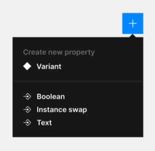

title:: 製作 Figma RWD Component 目標
新增日期:: [[Oct 12th, 2022]]
標籤:: #Figma #RWD #Component
作者:: [[@Luke]]
備註::

-
- 製作 Figma RWD Component 的目標為：
	-
	- 讓人可以輕易使用的 `分身 Instance`
		- 在 `分身 Instance` 上使用 Override，也不會影響 Component 的持續更新
		- 善用 Component Property (共 4 種 Properties)
			- 
	-
	- Variant 需要可以輕鬆的持續更新與管理
		- 可以被更新（每個物件儘量都要有準星出現。以方便更新內容）
		- 避免太複雜